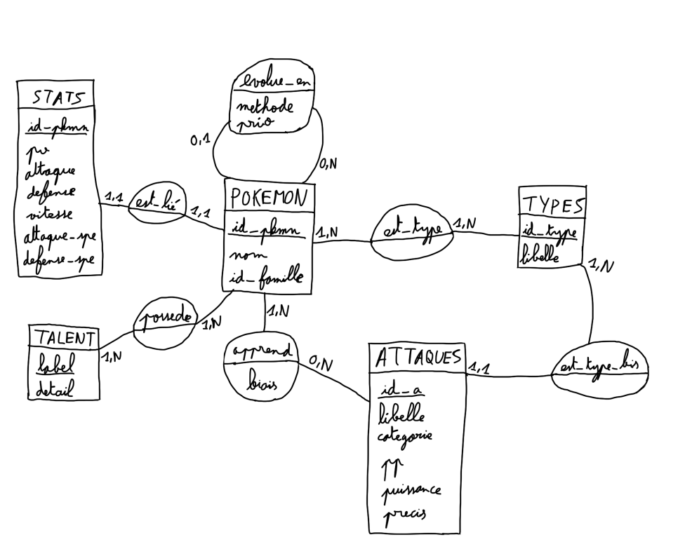

####  Préface

Nom du projet : MyPokéDex
Auteurs : Yassine BENMERAH et Chahine CHOUDAR, étudiants en INFO1 à Sup Galilée
Projet réalisé en juin 2026

Ce répertoire contient le travail réalisé pour la SAÉ site web. Notre projet est un Pokédex interactif majoritairement en PHP qui effectue des requêtes SQL en local grâce à la PDO.
La base de données est stockée en local grâce à WAMP/XAMPP et phpMyAdmin.

---
#### Fonctionnalités

Voici les différentes fonctionnalités de l'application selon les différentes pages ouvertes :

- index.php : page d'accueil du site. Elle contient la liste des 493 premiers Pokémons, donc de la première à la quatrième génération (de Bulbizarre à Arceus). Chaque Pokémon est décrit par son numéro de Pokédex, son nom, son ou ses types et ses statistiques : PV, attaque, défense, attaque spéciale, défense spéciale et vitesse. À l'exception des types, chaque attribut peut être trié par ordre croissant/décroissant, ou par ordre alphabétique pour le nom. Des boutons fléchés font appel au fichier tri.js pour gérer de manière dynamique l'affichage selon le tri voulu. Par ailleurs, les types sont représentés par des images disponibles dans les assets. Enfin, la barre de recherche permet d'effectuer une recherche selon des noms de Pokémon. Le motif voulu passe en paramètre d'une requête SQL préconstruite avec PDO. Chaque ligne contient un lien cliquable vers pkmn.php, qui changera selon l'id du Pokémon sélectionné.
- pkmn.php : page dédiée à l'affichage d'informations plus détaillées d'un Pokémon. Avec des requêtes SQL différentes, la page affiche les statistiques du Pokémon, son sprite (image issue des jeux Pokémon Noir 2/Blanc 2 - récupérée depuis PokeAPI) et son arbre d'évolution. En dessous, la page liste également les attaques que le Pokémon peut apprendre et de quelle manière. La page référencie également le ou les talents que possède le Pokémon. Comme dans index.php, les Pokémons qui partagent un arbre évolutif et les attaques apprises sont accessibles avec des liens cliquables. Petit bonus : cliquer sur le nom du Pokémon (le titre en haut de page) permet de changer le sprite du Pokémon en sa version shiny (un coloris différent). Un son est également joué pour la transition sprite normal -> sprite shiny. Tout cet aspect sur les sprites shiny est géré par le script shiny.js. Un bouton retour permet de retourner à la page index.php.
- attaque.php : page dédiée à l'affichage d'informations d'une attaque et des Pokémons pouvant l'apprendre. Comme index.php, des requêtes SQL sont préparées avec PDO pour sélectionner une fraction de nos données. De façon analogue aux autres fichiers, il est possible d'accéder aux Pokémons qui apprennent une attaque avec des liens cliquables. Un bouton retour permet de retourner à la page index.php.

D'autres fichiers php sont également dans le projet. Ils ne seront pas ouverts par le navigateur mais sont nécessaires pour le bon fonctionnement de l'application, à savoir :
    - db-pdo.php : vital pour le projet. C'est ici qu'est effectuée la connexion à la base de données. Des modifications sont nécessaires pour exécuter le programme, elles seront détaillées ultérieurement
    - fonctions.php : défini les fonctions php utilisées par les fichiers php principaux, ceux qui seront ouverts par le navigateur

---
### Stack technique

- WAMP 3.4.2 et XAMPP 8.2.12
- PHP 8.3.28
- MySQL 8.4.7
- HTML5 et CSS 3
- Bootstrap 5.3.8
- JavaScript ES2025 (pas de libraires externes ou de frameworks)

---
#### Schéma de la base de données

Ci-dessous se trouve un dessin du schéma relationnel de la base de données utilisée pour ce projet.

    

---
#### Installation et utilisation

Prérequis : avoir un serveur WAMP/XAMPP/MAMP etc. avec PHP, MySQL/MariaDB, Apache et phpMyAdmin.

Voici les étapes à réaliser :

1) Cloner le repo git
2) Lancer le serveur php (XAMPP/WAMP) et ouvrir phpMyAdmin
3) Modifier le fichier db-pdo.php de telle sorte à ce que $user et $pass contiennent respectivement un nom d'utilisateur et un mot de passe valide. Au plus simple, root fonctionne sans mot de passe donc on pourrait utiliser cet utilisateurn là par exemple. Une fois que les modifications sont faites, renommer db-pdo.php en db.php.
4) Copier-coller le contenu des fichiers .sql dans cette ordre : schema.sql -> pokemon-data.sql -> data-apprend.sql. Il faudra coller les scripts (ou les importer) dans la section SQL de phpMyAdmin. Attention ! Cette étape peut prendre une bonne minute à se réaliser, c'est normal vu la quantité de données de notre projet.
5) S'assurer que le repo git est dans le dossier adéquat (htdocs pour XAMPP, www pour WAMP, etc.)
6) Ouvrir le fichier avec http://localhost:8080/sae-site-web/index.php (adapter l'URL selon le port configuré)

---
#### Arborescence du projet

Ci-dessous se trouve l'arborescence du projet :

sae-site-web/
 
├── assets/
 
│   ├── images/
 
│   │   ├── acier.png
 
│   │   ├── BDD.png
 
│   │   ├── combat.png
 
│   │   ├── dragon.png
 
│   │   ├── eau.png
 
│   │   ├── electrik.png
 
│   │   ├── feu.png
 
│   │   ├── glace.png
 
│   │   ├── insecte.png
 
│   │   ├── normal.png
 
│   │   ├── physique.png
 
│   │   ├── plante.png
 
│   │   ├── poison.png
 
│   │   ├── psy.png
 
│   │   ├── roche.png
 
│   │   ├── spéciale.png
 
│   │   ├── spectre.png
 
│   │   ├── statut.png
 
│   │   ├── ténèbres.png
 
│   │   └── vol.png
 
│   └── sons/
 
│       └── shiny.mp3
 
├── css/
 
│   ├── style-attaque.css
 
│   ├── style-index.css
 
│   └── style-pkmn.css
 
├── js/
 
│   ├── shiny.js
 
│   └── tri.js
 
├── sql/
 
│   ├── data-apprend.sql
 
│   ├── pokemon-data.sql
 
│   └── schema.sql
 
├── .gitignore
 
├── attaque.php
 
├── db-pdo.php
 
├── fonctions.php
 
├── index.php
 
├── pkmn.php
 
└── README.md
 

---
#### Sources et remarques

Sources :
- PokeAPI
- Poképédia
- Bulbapedia
- Serebii.net
- Pokébip
- Pokémon Platine (jeu vidéo)

Les données représentées s'appuient sur le jeu Pokémon Platine, sorti en 2009 (Europe). Nous avons fait le choix d'exclure le type fée, introduit en 2013 à l'occasion de la sixième génération.
L'exclusion s'applique aussi sur les talents cachés apparus en cinquième génération et tout autre changement à posteriori de la quatrième génération.
Par exemple, dans les jeux récents, Ectoplasma a comme talent de base Corps Maudit à la place de Lévitation et l'attaque Éco-Sphère possède 90 de puissance au lieu de 80. 
